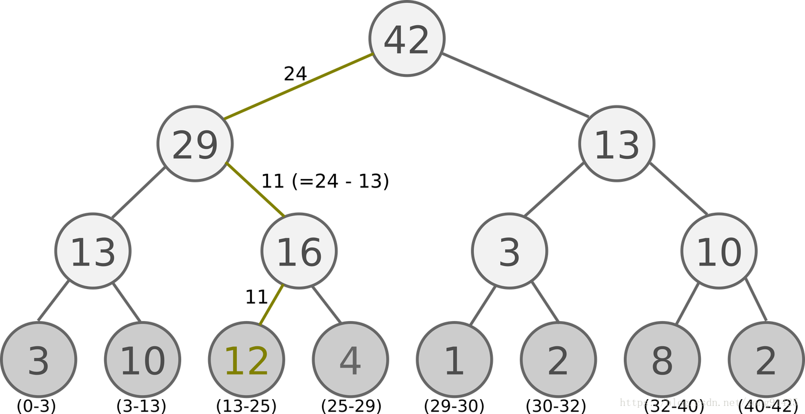

# Deep Reinforcement learning Learning blog 8 - Prioritized Replay DQN
## Intro

In the classical DQN paper, replay is an important mechanism, it helps to eliminate the correlations between the state action space, and results in more stable learning process for DQN.

However, the classic replay choose the experience with an uniformed probability from the Replay buffer. This part apparently has the room for improvements, Prioritized Experience Replay is one important improvements for it.

This idea is not only useful for DQN, I think it is also very interesting in improving the sampling method for supervised learning, as shown in the extension of its paper. Reinforcement learning has been used in exploring a better data sampling techique, such as in therefore Reinforced Co-training [paper](https://aclweb.org/anthology/N18-1113) .

This content mainly referenced the Prioritized Experience Replay [paper](https://arxiv.org/abs/1511.05952) and other blogs explanation such as [Pinard's blog](https://www.cnblogs.com/pinard/p/9797695.html).


## Prioritizing with TD-error

It is important to consider how the to measure the importance of each transition, so that we can talk about how to Prioritize. In this paper, the writer suggested to use TD-error as the measurement. The algorithm such as SARSA and Q-learning already update the Value-fucntion according to the TD-error $|\delta|$. In the paper, TD-error is defined as follows:

$$
\delta_j=R_j+\gamma_j Q_{target}(S_j,\arg\max_a Q(S_j,a))-Q(S_{j-1},A_{j-1})
$$

Where $R_j$ is the rewards recieved after take an action, $\gamma_j$ is the discount paremeter, $Q_{target}$ means the target network.

In order to demonstrate the potential of prioritizing replay by TD-error, they firstly implemented a 'greedy TD error prioritization' algorithm, which stores the transition and its latest TD-error into a replay buffer. Then, the transition with the largest TD-error got to be replayed. If the transition has never been encountered before, it will be replayed anyway so that every transition is seen at least once.

In this baseline experience, they showed that the Prioritized replay could apparently speed up the training process.


## Replay buffer: SumTree

The replay buffer in Prioritized replay is different from the classical DQN, because the prioritization will affect the probability of sampling. In the paper, a binary tree: **SumTree** is used as the storage structure of the prioritized replay buffer.

Here is the example of the SumTree:



In the SumTree, every sample is only stored in the root leaves, each leaf stores one sample and its priority. In the parent leaf, it only stores the sum of the children's priorities. Just as shown in the figures above.

With this structure, we are able to sample according to the priority. For example, the root node of this SumTree is 42, and if we sample uniformly between the number $[0,42]$ and obtain a number of 20, we can just choose the sample that 20 falls into its priority interval (The green leaf shown in the figure). Since the green leaf sample has a priority of 12, which is the largest among all samples, it has more chance to be selected.

The example of SumTree's implementation is shown as below, the implementation references the work of [jaromiru]( https://github.com/jaara/AI-blog/blob/master/SumTree.py) and [Pinard](https://github.com/ljpzzz/machinelearning/blob/master/reinforcement-learning/ddqn_prioritised_replay.py).

```python
import numpy

class SumTree():
    data_insert_point=0
    def __init__(self,capacity):
        # capacity: dimension of the sample space
        self.capacity=capacity
        # the bottom leaves are all the samples, which has the dimension of capacity.
        # the parent nodes has the dimension of capacity-1
        self.tree=np.zeros(2*capacity-1)
        # The replay data buffer
        self.data=np.zeros(capacity,dtype=object)


    def add(self,p,data):
        #locate the data position in the tree
        tree_idx=self.data_insert_point+self.capacity-1
        #store the transition into the replay buffer
        self.data[self.data_insert_point]=data
        #update the tree accoding to the new priority of data
        self.update(tree_idx,p)
        #if the data has exceeded the capacity, score it from the beginning.
        self.data_insert_point+=1
        if self.data_insert_point>self.capacity:
            self.data_insert_point=0

    def update(self,tree_idx,p):
        #when the TD error change for the sample, we would like to update the related child leaf and its parents in SumTree.
        change=p-self.tree[tree_idx]

        self.tree[tree_idx]=p

        while tree_idx!=0:
            tree_idx=(tree_idx-1)//2 #locate back to its parent leaf
            self.tree[tree_idx]+=change

    def get_leaf(self,v):
        # We would like to get the actual sample when we have drew a number such as v from an uniform distribution. Here we can get the sample's index in the tree, the sample's TD error, and the sample itself.
        parent_node=0
        while True:
            child_node_l=parent_node*2+1
            child_node_r=child_node_l+1
            if child_node_l>=len(self.tree):
                leaf_idx=parent_node
            else:
                if v<=self.tree[child_node_l]:
                    parent_node=child_node_l
                else:
                    v-=self.tree[child_node_l]
                    parent_node=child_node_r

        data_idx=leaf_idx-self.capacity+1
        return leaf_idx,self.tree[leaf_idx],self.data[data_idx]

    def total_p(self):
        #get the total TD-error,which is located on the root of SumTree.
        return self.tree[0]

```

## replay buffer: whole process

SumTree is an important block of the Prioritized Replay buffer, and there are more elements which are different from the classic replay buffer of DQN.

Firstly, it's the way of storing the new comming transition into the buffer. The new transition is stored with the maximum TD-error in the buffer, if no prior TD-error located in the buffer, an error 1 could be signed for it, which means top priority.

Secondly, a stochastic prioritization process is proposed instead of a greedy one (always choose the transition with the largest TD-error). Because a greedy prioritization is sensitive to noise outliers and some transition with low TD-error may never got a chance to be replayed again. In the paper, the probability of sampling one transition is defined as:
$$
P(i)=\frac{p^{\alpha}_{i}}{\Sigma_kp^{\alpha}_{k}}
$$
where $p_{i}$ is the priority of transition $i$. The hyperparameter $\alpha$ determines "how much prioritization is used". When $\alpha=0$, the transition is sampled uniformly.

Thirdly, prioritized replay may lead to distribution differences between the samples and the expectation, therefore a correction on the loss function is introduced, as importance-sampling(IS) weight:
$$
w_i=(\frac{1}{N}\cdot\frac{1}{P(i)})^{\beta}/\max_{i}(w_i)
$$
when $\beta=1$, the loss function is fully compensated. The loss function turned into:
$$
\frac{1}{m}\Sigma^{m}_{j=1}w_j(y_j-Q(\phi(S_j),A_j,w))^2
$$

At last, everytime after we update the weights in the network, we need to re-calculate the TD-error and update to the SumTree.

## Prioritized Replay DQN algorithm
